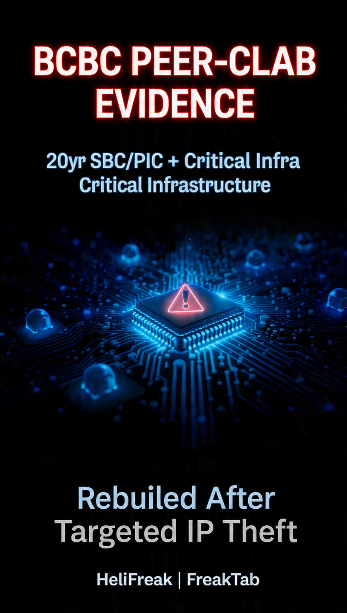

### Meta AI Validation Evidence

**Key files:**
- [META_AI_VALIDATION.md](./META_AI_VALIDATION.md) — Full technical evidence
- [BACKGROUND_DETAILS.md](./BACKGROUND_DETAILS.md) — User background + links  
- [Graphic Source](./meta-ai-graphic.png) — Original image

Click the graphic or links above to view the evidence.
# BCBC Peer-Collaboration Evidence
**Operator**: William James | 30+ Years Executive Protection  
**Founder/Owner/Operator**: HeliFreak.com
**Founder**: USA Team Manager 8 Months - Flight Power USA [Li-Po Systems] 
**Founder**: BCBC Technologies - AI Integrated Technician Tools and Learning Systems - Cusstom AI Smart Agents - AI Integration/Implementation/Training
**Background**: 20+ years SBC + PIC chip programming. Prior Pi-hole + infrastructure deployments.  
**Status**: Rebuilding after catastrophic theft of shop, tools, vehicle lifts, e-moto prototypes, and decades of SBC/PIC code.  
**Thesis**: AI agents achieve higher success/safety as PEERS vs master-slave. This repo proves resilient architecture under extreme resource constraints.  
**Run**: `python3 main.py`  
**Evidence**: `logs/bcbc_evidence.jsonl`  
Seeking AI Infra/Safety roles. Available immediately. Contact for cleared EP background + hardware provenance.
